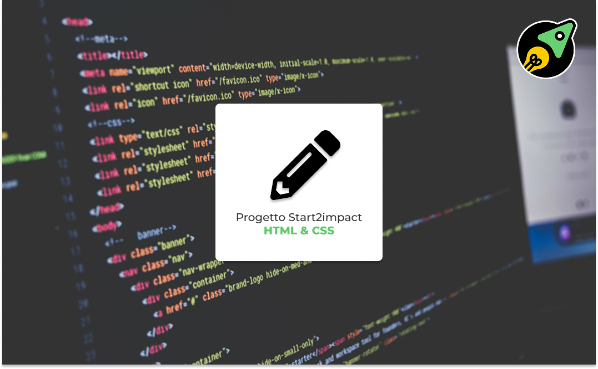

# S2I-HTML-CSS

[](https://ludovicobesana.github.io/S2I-HTML-CSS/)

Progetto pratico del [Corso HTML & CSS di start2impact](https://www.start2impact.it/corsi/html-css/): un sito personale a pagina singola pensato per presentare profilo, competenze e progetti a potenziali aziende, come richiesto dalla consegna del corso.

Demo: https://ludovicobesana.github.io/S2I-HTML-CSS/

Design Figma: https://www.figma.com/design/14Bnrel9cBxEEGZu0z3C3Q/Progetto-HTML---CSS-S2I?node-id=506-0&t=iEUX6LRRFv0OG7O4-1

## Struttura della pagina

Il sito è una single page divisa in sezioni, raggiungibili dalla navbar tramite anchor link (`#intro`, `#about`, `#portfolio`, `#skills`, `#path`, `#community`):

- **Intro**: card di presentazione in stile "profilo start2impact", con avatar, badge premium, percorso di studio, posizione in classifica, ore di formazione e cause a cui l'autore vuole contribuire.
- **About me**: breve bio testuale sul percorso di studi e le proprie passioni.
- **Portfolio**: griglia di progetti filtrabile per categoria (Mindset, Marketing, Sviluppo Web e App, UX/UI Design, Blockchain, Data Science, Startup), con filtro "ALL" e card colorate per categoria con link ai progetti.
- **Skills**: hard skill, soft skill e lingue, ciascuna con icona, livello numerico e tooltip esplicativo (popover Bootstrap) sul significato dei livelli.
- **Percorso**: barre di avanzamento per i diversi percorsi di studio (es. Marketing, Sviluppo & App), con indicatori di step (Inizio percorso, 50% Guide e Progetti, Progetto Finale, Ruolo Certificato).
- **Community**: galleria fotografica delle esperienze in community.
- **Footer**: logo personale, credit e link ai social (LinkedIn).

## Come è stato realizzato

- **HTML semantico**: markup diviso in sezioni (`header`, `section`, `footer`) con id dedicati per la navigazione via anchor.
- **CSS puro**, senza framework/preprocessori: layout basato su card centrate a larghezza fissa (1148px), con combinazione di flexbox per l'impaginazione generale e posizionamento assoluto per gli elementi decorativi interni alle card (icone, badge, etichette), replicando pixel-per-pixel il design fornito dal corso.
- **Google Fonts**: Montserrat, Poppins e Space Grotesk per differenziare titoli, sottotitoli e testo.
- **Bootstrap 3** (via CDN) usato solo per il componente popover (tooltip sui livelli di competenza) e jQuery come sua dipendenza.
- **JavaScript vanilla** per il filtro del portfolio: al click su un tag di filtro, le card vengono mostrate/nascoste tramite toggle della classe `.hide` in base all'attributo `data-item`/`data-filter`.
- **Responsive**: implementato per web, tablet e mobile.

## Tecnologie

- HTML5
- CSS3
- JavaScript (vanilla)
- jQuery + Bootstrap 3 (solo per i popover)
- Google Fonts

## Struttura del progetto

```
├── index.html
├── assets/
│   ├── css/
│   │   └── style.css
│   └── images/
│       ├── hardskills-icons/
│       ├── softskills-icons/
│       └── languages-icons/
├── LICENSE
└── README.md
```

## Autore

**Ludovico Besana**
[LinkedIn](https://www.linkedin.com/in/ludovicobesana/) - [ludovicobesana.com](https://www.ludovicobesana.com)

## Licenza

Distribuito sotto licenza MIT, vedi [LICENSE](LICENSE).
